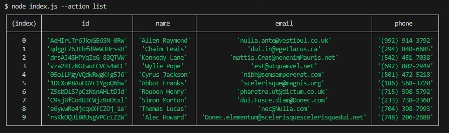
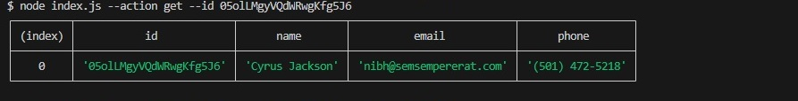
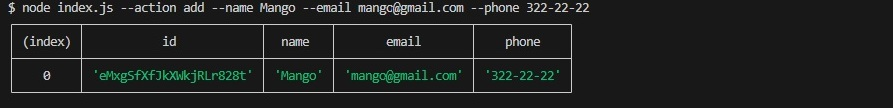
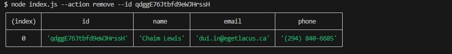

# Contact Management Commands

Here are the commands to interact with the Contact Management application. You can use these commands to perform various actions related to contacts.

## List Contacts

To retrieve and display the entire list of contacts as a table (console.table), use the following command:

`node index.js --action list`

## Get Contact by ID

To retrieve and display a contact by its ID, use the following command:

`node index.js --action get --id YOUR_CONTACT_ID`

## Add Contact

To add a new contact, use the following command:

`node index.js --action add --name YOUR_CONTACT_NAME --email YOUR_CONTACT_EMAIL --phone YOUR_CONTACT_PHONE`

## Remove Contact

To remove a contact by its ID, use the following command:

`node index.js --action remove --id YOUR_CONTACT_ID`

Please replace the placeholders like **YOUR_CONTACT_NAME**, with actual values when using these commands.
